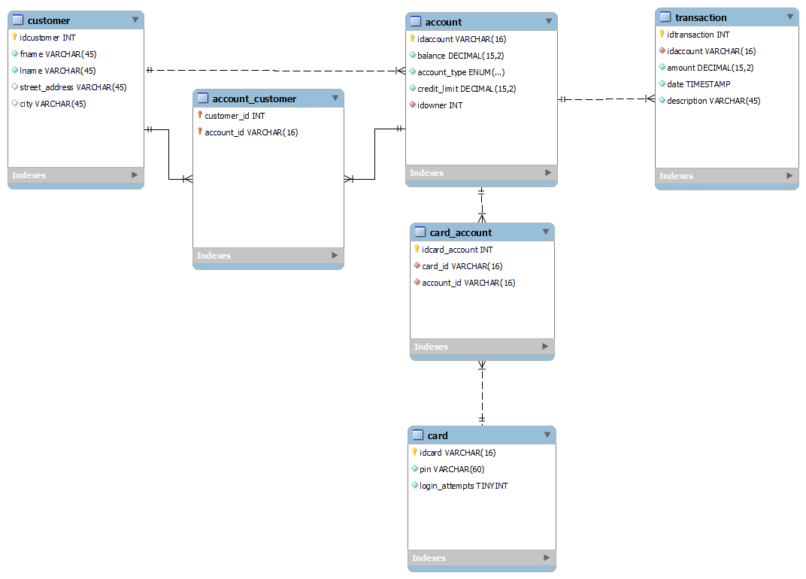

# Tietokanta

Tietokanta sisältää kaksi proseduuria:
- customerData(int customerid):
    - voidaan hakea tilit joihin käyttäjällä on käyttöoikeus.
- accountData(char accountid):
    - voidaan hakea käyttäjät joilla on käyttöoikeus tiliin.

